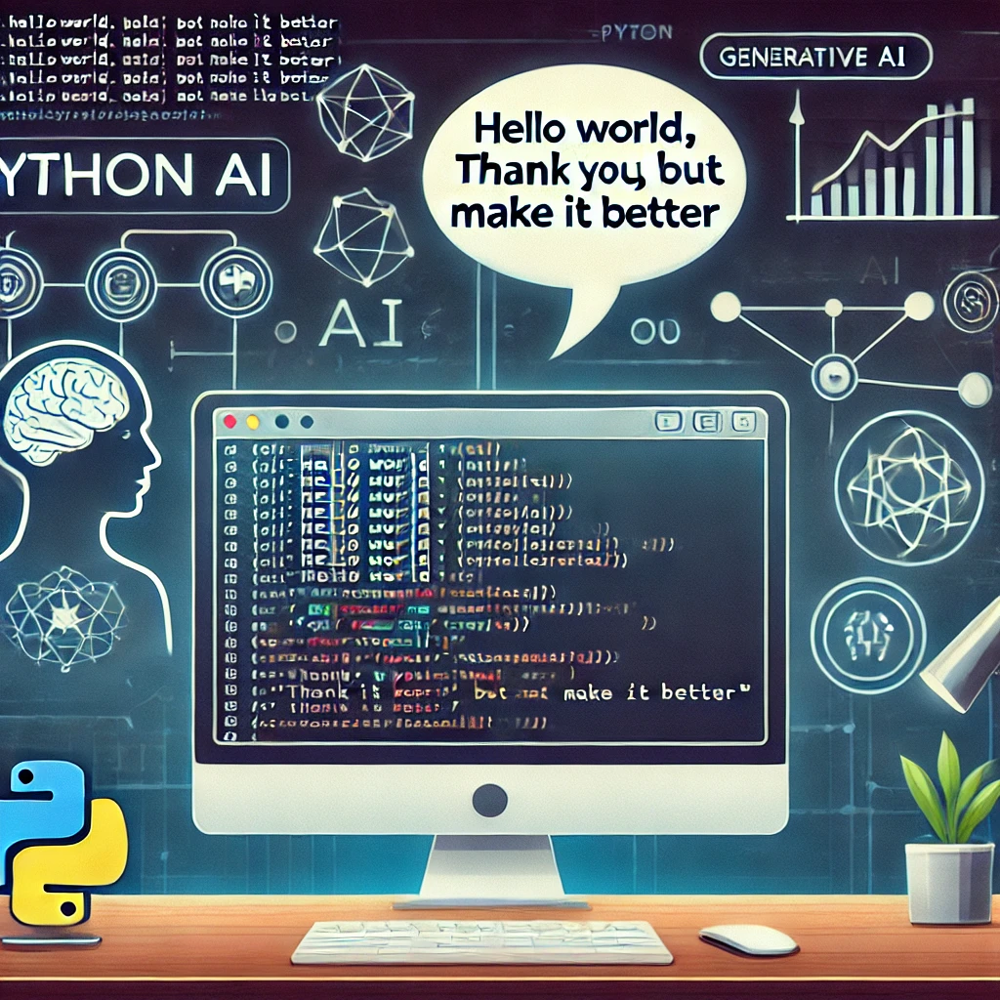

# Project Mega_helloworld: Make it better

## Objective
To explore the extent to which Generative AI can enhance a simple Python program when provided with perpetually vague feedback.

## Experiment Overview

1. **Initial Task**: Start with the classic programming task:
    - **Prompt**: "Write Hello World in Python."

2. **Feedback Loop**: Respond to every AI-generated improvement with:
    - **Response**: "Thank you, but make it better."

3. **Repetition**: Continue this cycle for 100+ iterations.

---
**Instructions:**
Run set your OpenAI API key in a config file and the run make_it_better.py

The program will save the conversation into a log\ directory as conversation.csv along with error.log which will logs key steps of the execution.
